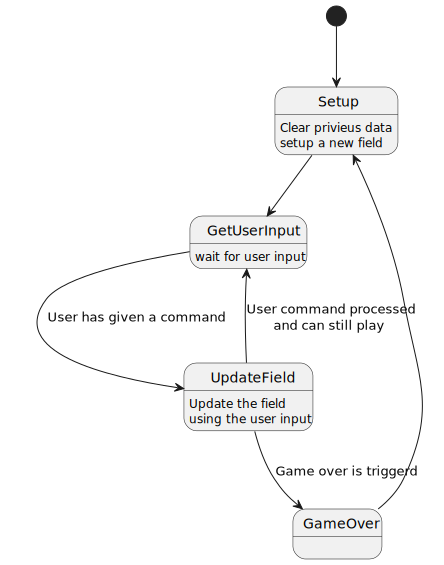
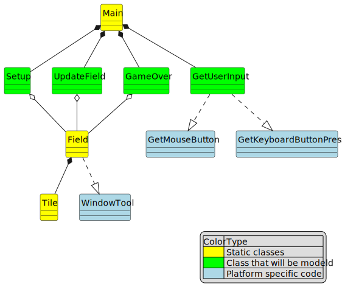

# Matrix engine software product line.

Author: Emiel Eij
Date: 13/09/2024

## Intro

For the model-driven software project, I revisited an old project I created during my first semester and realized it had strong potential for further development. This project is a Minesweeper game built in Windows Forms using C#. It was designed with classes, and I believe it can be further abstracted to easily accommodate other matrix-style games, allowing the underlying logic to be modeled for various types of games.

In this document, I will first explain how the Minesweeper game works. Then, I will describe how the logic can be generalized to support different kinds of games. Finally, I will discuss how these models can be integrated into the system to create a versatile software product line.

## How does the minesweeper application work?

The Minesweeper application is built in C# and interacts with Microsoft Forms via .NET function calls. The buttons in the .NET framework trigger calls to the IGame interface. Additionally, there is an IGameResults interface that gets called by the UI, which handles saving the scores to a file.

A significant portion of the logic is handled within the UI code, making this project less than ideal in terms of design and implementation (it was originally created during my second semester).

Moreover, the board component manages the core functionality of the program and contains a list of all the tiles. When you break this project down, many of the concepts are quite generic and align with common game engine principles.

### Current Features

* Generate a Minesweeper field
* Process clicks on field elements and respond accordingly
* Track the time it takes for the player to complete the game and save it as a score
* Allow loading and saving of previous scores for a user

As you can see, the current features are primarily focused on Minesweeper. In the next chapter, I will discuss how I plan to generalize this program so that other games can be modeled within the engine.

## Making this into a model driven game engine

To transform this project into a framework where all game logic can be modeled, I first need to identify which parts of the project remain consistent across games and which parts need to be easily customizable.

The core of a game engine is the sequence in which the game runs. I have modeled this using an activity diagram.

As shown in the diagram, there are several states where the behavior can be modeled and easily swapped out based on the requirements of the specific game you are designing.

Looking at the parts that need to be modeled, based on the state/activity diagram, these include generating the game field, processing user input, and handling game over events.

User Input
For the user input, a feature model can be used to define which actions are allowed in a particular game. For example, in a game like Snake, you might allow only the arrow keys for movement and disable tile-clicking, whereas for Minesweeper, you'd disable the keyboard and enable clicking on buttons instead. This ensures the input methods align with the game you're modeling.

I have created a class diagram to illustrate how the project will look when implemented using classes. In this design, the main program will manage the game states, calling the appropriate classes that are modeled according to the specific game being implemented.

This approach allows the project to be flexible and adaptable, where the core game logic remains the same, but the behavior can be customized for each game.

## variability mechanisms

To summarize, the variability mechanisms of the project will be focused on four key areas:
* Setup
* Update field
* Game over
* Get user input

### Get User Input

The get ***user input*** mechanism is determined by a feature model. This allows different games to specify which inputs are valid (e.g., keyboard for Snake, mouse clicks for Minesweeper).

### Setup

The ***setup*** mechanism can either use a standard field or generate one dynamically, depending on the game. For example, Snake always starts with an empty field containing a snake and a food item. In contrast, Minesweeper requires a field to be generated with tiles, some of which contain bombs.

### Update Field

The ***update field*** mechanism is where the game logic specific to each game is applied. For example, in Snake, the game checks if the snake hits a boundary or eats a "fruit," updates the field by moving the snake, adding a block to the tail, etc. In Minesweeper, the logic checks if a clicked tile contains a bomb or needs to clear adjacent tiles, and the field is updated accordingly.

### Game Over

The ***game over*** mechanism is straightforward: the user can choose to start a new game or save the score they achieved.

This modular approach ensures flexibility, allowing for different games to be modeled while maintaining a consistent structure across the project.
